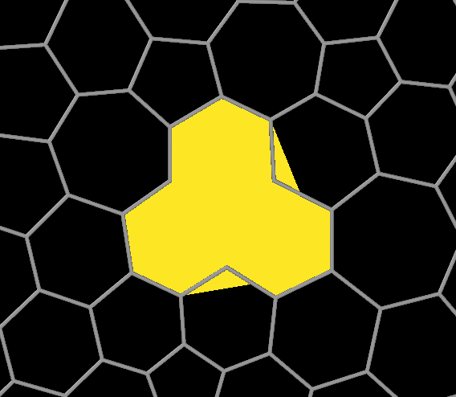

# Ring Finder

This modifier for OVITO finds closed rings formed by bonds, counts them, and visualizes them as polygonal facets.
It only identifies rings whose sizes fall within a specified range, defined by minimum and maximum numbers of bonds.

## Description

The modifier outputs the following things:
  - Global attributes:
    - `RingCount`: The total number of rings found.
    - `N-RingCount`: Number of *N*-sized rings, where *N* is a number ranging from `min_size` to `max_size`.
  - Data tables:
    - *Ring size histogram*: Histogram of the ring sizes (absolute bin counts).
    - *N-ring list*: List of the particle indices making up the individual *N*-sized rings, where *N* is a number ranging from `min_size` to `max_size`.
  - Surface mesh (optional): 
    - A visualization of the rings as polygonal facets. Each facet has a `Ring Size` property
      that indicates the size of the ring it represents. Using the color mapping feature of the [surface mesh visual element](https://docs.ovito.org/reference/pipelines/visual_elements/surface_mesh.html#visual-elements-surface-mesh),
      the facets can be colored according to their size.

## Parameters 

| GUI name                                                                                                                                | Python name          | Description                                                                                                                                                   | Default Value |
|-----------------------------------------------------------------------------------------------------------------------------------------|----------------------|---------------------------------------------------------------------------------------------------------------------------------------------------------------|---------------|
| **Minimum ring size**                                                                                                                   | `min_size`           | Minimum size of the rings identified by the modifier.                                                                                                         | `3`           |
| **Maximum ring size**                                                                                                                   | `max_size`           | Maximum size of the rings identified by the modifier.                                                                                                         | `10`          |
| **Create polygons**                                                                                                                     | `create_mesh`        | Output a polygon facet for each ring.                                                                                                                         | `True`        |
| **Triangulate facets**                                                                                                                  | `triangulate_facets` | Triangulate facets using an improved algorithm. Slower than the standard algorithm, but can provide better results for non-convex rings (see below).          | `False`       |
| **[Surface mesh vis](https://docs.ovito.org/reference/pipelines/visual_elements/surface_mesh.html#visual-elements-surface-mesh)**       | `mesh_vis`           | Visual element controlling the appearance of the ring facets.                                                                                                 |               |

## Example


With the standard triangulation algorithm, non-convex rings can produce artifacts:



The improved triangulation algorithm can handle non-convex rings better, but is slower:


## Installation

This modifier is included in the [OVITO Extension Directory](https://www.ovito.org/extensions/) and can be [installed via the OVITO Pro GUI](https://docs.ovito.org/advanced_topics/python_extensions.html#topics-python-extensions-gallery).

Alternatively, you can install the modifier from the command line using the `ovitos` command line tool [that comes with OVITO Pro](https://docs.ovito.org/python/introduction/installation.html#ovito-pro-integrated-interpreter):
```
ovitos -m pip install --user git+https://github.com/ovito-org/RingFinder.git
``` 
The `--user` option is recommended and [installs the package in the user's site directory](https://pip.pypa.io/en/stable/user_guide/#user-installs).

If you are using a standalone Python interpreter or a Conda environment:
```
pip install git+https://github.com/ovito-org/RingFinder.git
```

## Contact
Daniel Utt (utt@ovito.org)
