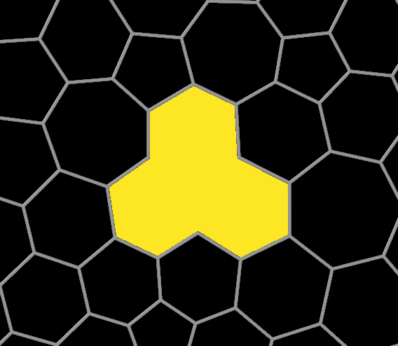

# Ring finder
Finds shortest rings formed by bonds in the system

## Description
The modifier outputs:
  - Global Attributes:
    - "RingCount": Total number of rings found
    - "*N*-RingCount": Number of *N*-sized rings found.
  - Data Tables:
    - "*N*-Rings": List of the particle indices making up the *N*-sized rings.
    - "Ring Sizes": Histogram of the different ring sizes.
  - Surfaces: 
    - "Ring Mesh": If selected contains the surface meshes visualizing the rings.

## Parameters 

| GUI name                                                                                                                                | Python name          | Description                                                                                                                                                   | Default Value |
|-----------------------------------------------------------------------------------------------------------------------------------------|----------------------|---------------------------------------------------------------------------------------------------------------------------------------------------------------|---------------|
| **Minimum ring size**                                                                                                                   | `min_size`           | Minimum size of the rings found by the modifier.                                                                                                              | `3`           |
| **Maximum ring size**                                                                                                                   | `max_size`           | Maximum size of the rings found by the modifier.                                                                                                              | `10`          |
| **Create mesh**                                                                                                                         | `create_mesh`        | Output meshes for each ring.                                                                                                                                  | `True`        |
| **Triangulate facets**                                                                                                                  | `triangulate_facets` | Triangulate facets using a different algorithm. Slower than the default algorithm used in OVITO, but can lead to better results for concave rings / polygons. | `False`       |
| **[Surface Mesh Vis](https://www.ovito.org/manual/reference/pipelines/visual_elements/surface_mesh.html#visual-elements-surface-mesh)** | `mesh_vis`           | Visual element used for the output meshes.                                                                                                                    |               |

## Example


Using the default mesh generation for a concave polygon (ring):


Using the custom mesh generation for a concave polygon (ring):


## Installation
- OVITO Pro [integrated Python interpreter](https://docs.ovito.org/python/introduction/installation.html#ovito-pro-integrated-interpreter):
  ```
  ovitos -m pip install --user git+https://github.com/ovito-org/RingFinder.git
  ``` 
  The `--user` option is recommended and [installs the package in the user's site directory](https://pip.pypa.io/en/stable/user_guide/#user-installs).

- Other Python interpreters or Conda environments:
  ```
  pip install git+https://github.com/ovito-org/RingFinder.git
  ```

## Technical information / dependencies
- Tested on OVITO version 3.9.3

## Contact
Daniel Utt (utt@ovito.org)
